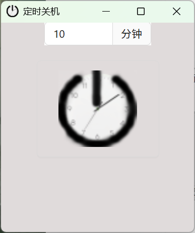
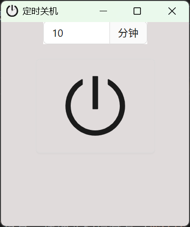
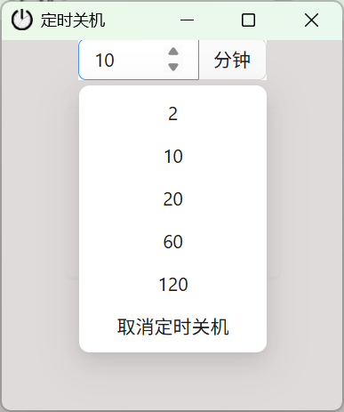

# Clock Shutdown

一个简洁易用的 Windows 定时关机工具，基于 Wails 框架开发。

## 功能特性

- **灵活的延迟设置** - 在输入框中填写分钟数，一键设定定时关机
- **快捷预设时间** - 点击输入框右侧下拉菜单，快速选择预设时长（2、10、20、60、120 分钟）或直接取消定时
- **取消定时关机** - 将分钟数设为 `-1` 或负数（或从下拉菜单选择"取消定时关机"），即可取消已有的关机计划
- **自动冲突处理** - 若系统中已存在定时关机任务，程序会自动先取消旧任务，再重新设置新定时，无需手动干预
- **记忆上次设置** - 上次使用的定时时长会自动保存到本地，下次启动时自动恢复
- **设置后自动退出** - 定时设置成功后，界面会显示进度条倒计时，约 12 秒后程序自动最小化并退出，不占用任务栏
- **防遗忘保障** - 工作或游戏结束后突然想起有事？只需重新输入新的延迟时间并确认，程序会自动替换旧计划，无需重新启动
- **现代化界面** - 简洁直观的图形化界面，比命令行工具更易使用
- **按钮样式切换** - 右键点击关机按钮，可在系统图标和自定义 Logo 两种样式之间切换，样式偏好自动保存

## 使用方法

1. 启动程序后，在输入框中输入希望延迟的分钟数（也可点击输入框旁的下拉箭头选择预设值）
2. 点击中央的关机按钮，程序将调用系统命令设置定时关机
3. 设置成功后，程序会弹出提示，显示进度条并在约 12 秒后自动退出
4. 如需取消关机计划，重新启动程序，将分钟数设为 `-1` 或从下拉菜单选择"取消定时关机"，再点击关机按钮即可

## 使用场景

- 工作日结束时延迟关机，给自己反应时间
- 游戏会话后有序关闭系统
- 日常工作中临时调整关机计划
- 避免因仓促关机导致忘记保存重要数据

## 技术栈

- **后端**: Go
- **前端**: React + Vite
- **框架**: Wails (Go + JavaScript 桌面应用框架)

## 开发

### 实时开发模式

在项目目录运行以下命令进入实时开发模式：

```bash
wails dev
```

Vite 开发服务器将提供前端代码的快速热重载。开发服务器运行在 `http://localhost:34115`，支持直接调用 Go 方法。

### 构建

生成生产环境可分发的安装包：

```bash
wails build
```

## 项目配置

可通过编辑 `wails.json` 配置项目设置。详细文档请查看 [Wails 项目配置文档](https://wails.io/docs/reference/project-config)

## 外观展示
  

 